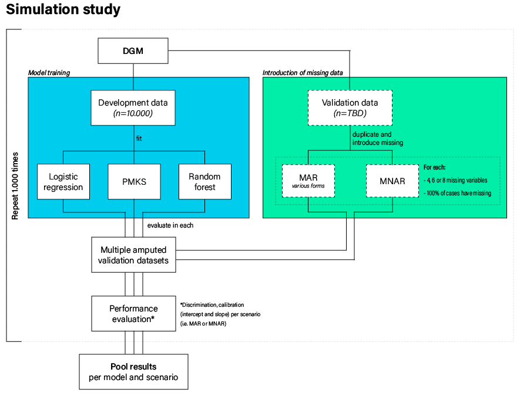

Simulation pipeline organized according to the ADEMP approach: Aims, Data-generating mechanisms, Methods, Estimands, Performance measures.

TODO:

- Check where else it says "TODO" and "Add" throughout this file

- check c-stat [.6-.9]

- report the betas

- Add motivating example with MIMIC data (first impute once with some non-parametric model like an AE, then fit some prediction model on the completed population data)

- Choose a nice logistic prediction model for the motivating example, like a certain diagnosis or 48h mortality (not 30 day mortality, because then you need time-to-event models)

- Rename mean imp to CMI

- Rerun sim without higher order terms    

- After running the simulation, check convergence of the population diagnostics to see if 1000 repetitions was enough





```{r setup, message = FALSE, warning = FALSE, include = FALSE}
# environment
library("dplyr") #for the pipe operator
library("ggplot2") #for plotting
library("ggcorrplot") #for easy visualization of correlations
library("mvtnorm") #for multivariate normal distributions
library("purrr") #for vectorized 'for loops'
library("pROC") #for easy calculation of the auc
library("mice") #for missing data stuffs
library("ranger") #for fast random forests
# library("missRanger") #for fast random forests with imputation
library("rms") #for restricted cubic splines
library("party") #for random forests with surrogate splits
# library("moreparty") #for faster version of random forests with surrogate splits
# library("foreach") #for parallelization of random forests
# library("doParallel")
# doFuture::registerDoParallel()
# library("doFuture")
# doFuture::registerDoFuture()
# y <- plyr::llply(1:2, identity, .parallel = TRUE)

# # data
# load("./Data/varcov.RData") #variance-covariance matrix of the SMART dataset

# functions
source("./R/DGM.R") #data generating mechanism
source("./R/fit.R") #fit models on complete data
source("./R/imp.R") #impute missing data
source("./R/pred.R") #predict outcome variable from incomplete data
source("./R/perf.R") #compute performance measures for each method
source("./RunSim.R") #run all at once for development purposes

# setup environment
# run this once
set.seed(11)
n_sim <- 2 #TODO: make this 1000
n_devset <- 10000
n_valset <- 20000
p <- 10
DGM <- define_DGM(p = 10)
```

```{r testrun, eval=FALSE, include=FALSE}
# run this chuck only for development purposes (e.g., new functions)
# setup_env()
# sim_once()
```

# Aims

This document contain the set-up of our SIG project titled "An evaluation of 'real-time' missing data handling in machine learning and prevailing statistical models". The aim is to compare different strategies for developing prediction models that can handle the presence of missing values real time in a single patient. Preferred journal: Stat. Med.

# Data-Generating Mechanisms

We use model-based simulation, with a single data-generating mechanism for the development data and validation sets. The development set is used as-is; the validation set is subsequently 'amputed'.

## DGM model

We use a DGM model with: 

- 10 continuous predictors ($X_1$, $X_2$, ..., $X_{10}$), with cases generated from a multivariate normal distribution;^[Note. Potentially add dichotomous predictor(s) later.]
- 1 binary outcome ($Y$), calculated from the 10 predictors.

We decided against the use of a 'real world' variance-covariance matrix for the predictor variables. Initially, we were going to use the SMART data as the basis for our predictor space. But this would result in the same limitations as described in Nijman et al. (2021; i.e., low correlations between predictor variables). 

Therefore, we randomly generated a variance-covariance matrix for the purpose of this study. This matrix^[Note. Maybe add more variance-covariance matrices for sensitivity analyses later. E.g., add one with 200 predictors.] serves as the basis for each development and/or validation dataset used in this study. 

```{r varcov}
# create a variance-covariance matrix with p predictors
# DGM <- define_DGM(p = 10)
# ggcorrplot::ggcorrplot(cov2cor(varcov), type = "lower", lab = TRUE)

# create vectors with regression coefficients for linear and non-linear effects

```

We use the 10 predictors to calculate the dichotomous outcome. The current DGM model includes one cubic term and 9 interactions. For additional complexity, we add one log-transformation (the natural logarithm of the absolute value of the second predictor).

Regression coefficients for the linear predictor of Y are `r DGM$betas[1:p]` for the univariate effects of the 10 predictors. Regression coefficients for the interaction effects are `r DGM$betas[(p+1):(2*p)]`. 

## Development set

We use a sample size of 10.000 in the development sets. One such set is generated below.

```{r devset}
# let's generate some data 
devset <-
  generate_sample(
    sample_size = n_devset,
    covariance_matrix = DGM$varcov,
    linear_bs = DGM$betas[1:p],
    non_linear_bs = DGM$betas[(p+1):(2*p)],
    interaction = TRUE
  )

# what do the data look like?
glimpse(devset)
ggcorrplot::ggcorrplot(cor(devset[, -1]), type = "lower", lab = TRUE, digits = 3, legend.title = "Correlation")

```

The aim is to have a prevalence of about 0.15. In this dev set, the prevalence of the outcome is `r mean(devset$Y)`. We can now fit the different models.

```{r fit}
# # logistic model
# mod_log <- fit_log(devset[,-1])
# 
# # box of submodels
# mod_sub_6 <- fit_sub(devset[,-1], Y ~ X1 + X2 + X3 + X4 + X5 + X6)
# mod_sub_4 <- fit_sub(devset[,-1], Y ~ X1 + X2 + X3 + X4)
# mod_sub_2 <- fit_sub(devset[,-1], Y ~ X1 + X2)
# 
# # random forest models with imputation and with surrogate splits
# mod_rf_imp <- fit_rf_imp(devset[,-1])
# # mod_rf_sur <- fit_rf_sur(devset[,-1])

mod <- fit_mod(devset)

auc_log <-
    pROC::roc(
      Y ~ prob,
      data = cbind(devset, prob = predict(mod$log, newdata = devset[,-1])),
      quiet = TRUE
    )$auc
```

The c-statistics of the logistic model is `r auc_log`.

## Validation set

We use a sample size of 20000 in the validation sets, to make sure there are at least 2000 events in de val set, with the prevalence of ~0.15. 

```{r valset}
# generate complete validation set
valset <-
  generate_sample(
    sample_size = n_valset,
    DGM$varcov,
    DGM$betas[1:p],
    DGM$betas[(p+1):(2*p)],
    interaction = TRUE
  )
```

The number of events in this val set is `r sum(valset$Y)`. The next step is to ampute the validation set using several missing data patterns and missingness mechanisms. 

We use a mixture of three missing data patterns, with 40%, 60%, and 80% of variables being missing per case. The missingness mechanisms are a mixture as well: we combine the four types of MAR missingness ("MAR left", "MAR right", "MAR mid", and "MAR tail").

```{r missingness}
# define the missingness parameters
#miss_par <- define_miss(p = nrow(DGM$varcov))
```

Ampute the validation set according to the missing data patterns and missingness mechanisms.

```{r ampute}
# make the validation set incomplete according to the missing data pattern and MAR types
valset <- create_miss(valset, missingness_pat = DGM$miss_pat, missingness_type = DGM$miss_type)
# check missing data pattern
md <- mice::md.pattern(valset[,-c(1:3)])
```

# Estimands

We calculate the absolute outcome risk for each individual observation (i.e. patient) according to five different strategies for dealing with missing values, and three different prediction models.


# Methods

The three methods for prediction model development are:

- Strategy 1: The prediction model is a flexible regression model including non-linear effects using RCS (restricted cubic splines) with 3 knots^[check definition, use package `RCS`]. We also store the means and covariance of all predictor variables (using package `condmvnorm`, which can be used to generate imputations).

- Strategy 2: The prediction model is a "box" of submodels: a flexible  regression model is developed for each possible combination of available predictors. If we have 10 predictor variables, this means that we would have to fit 1  + 10 + 45 + 120 + 210 + 252 + 252 + 210 + 120 + 45  + 10 + 1  = 1276 regression models. However, there is no need to estimate all these models. We can first look in the hold-out sample what variable is missing, and then estimate the necessary "submodel". In our case, we estimate just 3 submodels (with 2, 4, or 6 variables observed according to the missing data pattern).

- Strategy 3: The prediction model is a random forest, as implemented by `cforest()` in the R package `party`. We generate a certain number of surrogate splits for each node. These splits attempt to mimic the primary split, and thus to achieve similar separation using another (observed) variable. By default set 4 surrogate splits (since we set max 3 missings). See "surrogate decisions based on additional variables (cf. Breiman et al., 1984; Hothorn et al., 2006)" (Hapfelmeier, p. 6). This is **very** computationally inefficient, so we'll need HPC power. Because in the clinical setting a 15 minute fitting procedure is not terrible, we do not scrap this method. However, we could also implement random forests in the presence of missing data using the `missranger` package. We'll add this method because it seems popular and efficient. We'll also use the joint method (Nijman et al.) to impute before fitting the `ranger` random forest.

Sidenote for strategy 3: Random forests are very susceptible to variations in the calibration slope, even in contexts without missingness. With huge devsets (i.e., `n_obs > 1.000.000`) or average performance across simulation repetitions, this problem fades. But we'll need to specifically check the calibration of the random forest models just to be sure!

The five methods for dealing with missing values are:

- (Only for strategy 1 and 3): Missing values are imputed by their conditional mean.^[What to do with categorical predictors? Make dummy variables for each level? See Nijman et al paper!]

- (Only for strategy 1 and 3): Missing values are imputed by a random draw from their conditional multivariate distribution.

- (Only for strategy 1 and 3): Missing values are imputed 50 times by a random draw from their distribution. The resulting 50 absolute risk predictions are then averaged to obtain the final prediction.

- (Only for strategy 2): The appropriate pattern submodel is selected for calculating an absolute risk.

- (Only for strategy 3): Missing values are handled using the surrogate splits.

For the first three missing data methods, we need to impute the missing values. The other two do not require this extra step. 

```{r impute}
# for the imputation methods, we need to fill in the missing values in the validation data
valset %>% glimpse() 
# for evaluation purposes, this includes the outcome (Y = observed outcome; Y_prob = hypothetical probability of the outcome) and the number of missing predictor values

# impute the data, split by number of missing variables for computational efficiency
imp_all <- purrr::map(c(4,6,8), ~comp_cond(devset[,-c(1:2)], valset[,-c(2:3)], m = 21, p = .x))
# TODO: set number of imputations to 51 in actual simulation
```

Now we can generate predictions for each of the cases in the validation set.

```{r predict}
# predict Y using the box of submodels method
Y_pred_sub <- pred_sub(valset[,-c(2:3)], mod$sub$p2, mod$sub$p4, mod$sub$p6)

# predict Y using random forest with surrogate splits (switched off because of computational load)
Y_pred_rf_sur <- rep(0, nrow(valset)) 
# TODO: uncomment this part in actual simulation
# Y_pred_rf_sur <- predict(mod_rf_sur$mod, newdata = valset[,-c(1,2)])
# # saveRDS(Y_pred_rf_sur, file = "Data/rf_sur.RDS")
# # readRDS("Data/rf_sur.RDS")

# predict Y using the imputation methods icw glm and random forest models
Y_pred_mean <- suppressWarnings(pred_mean(imp_all, mod$log, mod$rf))
Y_pred_draw <- suppressWarnings(pred_draw(imp_all, mod$log, mod$rf))
```

Note for the placeholder data (always predict Y = 0) is that there is no discrimination whatsoever.

# Performance measures

List all performance measures to be estimated, justifying their relevance to estimands or other targets. 

We evaluate the predicted outcome risk against the original outcome risk (i.e. the absolute outcome risk that would be obtained if we have no missing values). 
Calculate:

- Root mean square prediction error;

- Brier score (predicted risk vs observed outcome).

Finally, across all hold-out patients:

-	Calibration of (predicted Y | one or more missing predictor values) versus (predicted Y | original predictor values) --> calibration slope (voor methode 1 underfitting and slope > 1?);

-	Discrimination of (predicted Y | one or more missing predictor values) versus (predicted Y | original predictor values);

-	Visual inspection of calibration plot (see plot Gary Collins in Stat med paper, min 100 events).

TODO: Add **MAPE, RMSPE, mean absolute distance wrt real prob., think about AIC and calibration intercept and calibration slope on population level while we're interested in individual level.**

TODO: add real intercept (this one is re-estimated) using logistic model (en met offset eromheen voor intercept).

root mean sq distance van log calib slope (ideaal is 0, dus verder is slechter). bijv van lasso hele hoge variantie terwijl gem perfect is.

```{r performance}
# combine the predictions from the different methods
pred_list <- list(Y_prob = valset$Y_prob,
                  Y_obs = valset$Y,
                  Y_sub = Y_pred_sub,
                  Y_rf_sur = Y_pred_rf_sur,
                  Y_mean_log = Y_pred_mean$mean_log,
                  Y_sing_log = Y_pred_draw$sing_log,
                  Y_mult_log = Y_pred_draw$mult_log,
                  Y_mean_rf = Y_pred_mean$mean_rf,
                  Y_sing_rf = Y_pred_draw$sing_rf,
                  Y_mult_rf = Y_pred_draw$mult_rf)
# RMSErf
(RMSE_obs <- purrr::map(pred_list, ~ calc_RMSE(pred = ., obs = pred_list[["Y_obs"]])))
(RMSE_prob <- purrr::map(pred_list, ~ calc_RMSE(pred = ., obs = pred_list[["Y_prob"]])))

# brier score
# (brier_obs <- purrr::map(pred_list, ~ calc_brier(pred = ., obs = valset[, "Y_obs"])))
(brier_prob <- purrr::map(pred_list, ~ calc_brier(pred = ., obs = pred_list[["Y_prob"]])))
# Let op: Komt de kans richting het gemiddelde? Zie prestatie van 'methode' met alleen 0en als predicted prob invullen.

rms::val.prob(p = Y_pred_sub, y = valset$Y)
rms::val.prob(p = Y_pred_draw$mult, y = valset$Y)

# plot calibration
plotdat <- data.frame(obs = rep(pred_list$Y_prob,4), pred = c(pred_list$Y_sub, pred_list$Y_imp_mean, pred_list$Y_imp_sing, pred_list$Y_imp_mult), method = c("submodel", "cond.imp", "sing.imp", "mult.imp"))
ggplot(plotdat, aes(x = pred, y = obs, color = method)) +
  geom_point(alpha = 0.01) +
  geom_smooth(fullrange = T) + 
  geom_abline(intercept = 0, slope = 1, linetype = "dashed") + 
  facet_wrap(~method) + 
  theme_classic() + 
  lims(x = c(0,1), y = c(0,1))
```

