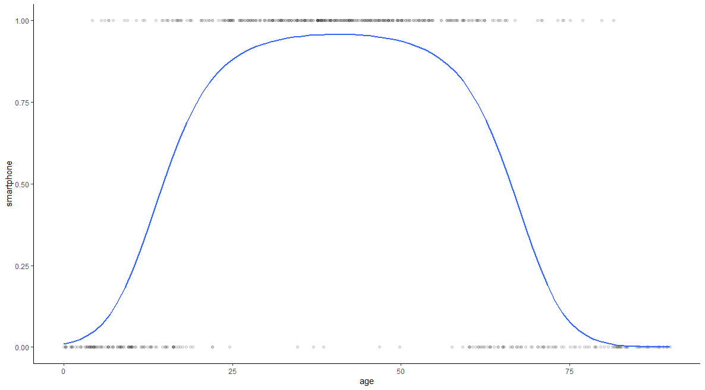

Simulation pipeline organized according to the ADEMP approach: Aims, Data-generating mechanisms, Methods, Estimands, Performance measures.


```{r setup, message = FALSE, warning = FALSE, include = FALSE}
# environment
library("dplyr") #for the pipe operator
library("ggcorrplot") #for easy visualization of correlations
library("mvtnorm") #for multivariate normal distributions
library("pROC") #for easy calculation of the auc
library("mice") #for missing data stuffs
library("ranger")
library("randomForest")

# # data
# load("./Data/varcov.RData") #variance-covariance matrix of the SMART dataset

# functions
source("./R/DGM.R") #data generating mechanism
```

# Aims

This document contain the set-up of our SIG project titled "An evaluation of 'real-time' missing data handling in machine learning and prevailing statistical models". The aim is to compare different strategies for developing prediction models that can handle the presence of missing values real time in a single patient.


# Data-Generating Mechanisms

We use design-based simulation, with a single data-generating mechanism for the development data and validation sets. The development set is used as-is; the validation set is subsequently 'amputed'.

## DGM model

We use a DGM model with: 

- 10 continuous predictors ($X_1$, $X_2$, ..., $X_{10}$), with cases generated from a multivariate normal distribution;^[Note. Potentially add dichotomous predictor(s) later.]
- 1 binary outcome ($Y$), calculated from the 10 predictors.

We decided against the use of a 'real world' variance-covariance matrix for the predictor variables. Initially, we were going to use the SMART data as the basis for our predictor space. But this would result in the same limitations as described in Nijman et al. (2021; i.e., low correlations between predictor variables). 

Therefore, we randomly generated a variance-covariance matrix for the purpose of this study. This matrix^[Note: maybe add more variance-covariance matrices for sensitivity analyses later.] serves as the basis for each development and/or validation dataset used in this study. 

```{r varcov}
# create a variance-covariance matrix with p predictors
set.seed(123)
p <- 10
betas <- rnorm(p*(p-1)/2, 0, 0.1)
sigma <- diag(p)
sigma[upper.tri(sigma)] <- betas
sigma[lower.tri(sigma)]  <- t(sigma)[lower.tri(sigma)]
Sigma <- t(sigma) %*% sigma
# isSymmetric(Sigma)
ggcorrplot::ggcorrplot(cov2cor(Sigma), type = "lower", lab = TRUE)
```

We use the 10 predictors to calculate the dichotomous outcome. The current DGM model includes one cubic term and 9 interactions. We also added one log-transformation (natural logarithm of the absolute value of the second predictor), and will add one (restricted cubic) spline.

### Q: Would the qubic term be sufficient instead of a spline, since this results in a 'U shaped' logistic curve?

That is, a quadratic relation between a predictor and a binary outcome looks like the figure below. You can imagine to fit a spline with 4 knots through this logistic curve. Is an explicitly simulated spline then still necessary?



For now, the outcome is calculated using one log-transformation, one cubic term, and 9 interactions.


## Development set

We use a sample size of 10.000 in the development sets. One such set is generated below.

```{r devset}
# let's generate some data 
n <- 10000
set.seed(11)

# generate the regression coefficients
linear_betas <- runif(nrow(Sigma), -10, 10)
non_linear_betas <- runif(10, -1, 1)
dat <- generate_sample(n, Sigma, linear_betas, non_linear_betas, interaction = TRUE)

# what do the data look like?
glimpse(dat)

# save data
saveRDS(dat, file = "Data/dataset.RDS")
```

In this dev set, the prevalence of the outcome is `r mean(dat$Y)`. 

How well do the three types of models fit?

```{r fit}
# check prevalence and auc of the models
# logistic model
logistic <- fit_logistic(dat)
# saveRDS(logistic, file = "Data/logistic_model.RDS")

# pattern mixture models
mod4 <- glm(Y ~ X1+X2+X3+X4+X5+X6, family = "binomial", data = dat)
mod6 <- glm(Y ~ X1+X2+X3+X4, family = "binomial", data = dat)
mod8 <- glm(Y ~ X1+X2, family = "binomial", data = dat)
auc4 <-
    pROC::roc(Y ~ prob,
              data = cbind(dat, prob = predict(mod4)),
              quiet = TRUE)$auc
auc6 <-
    pROC::roc(Y ~ prob,
              data = cbind(dat, prob = predict(mod6)),
              quiet = TRUE)$auc
auc8 <-
    pROC::roc(Y ~ prob,
              data = cbind(dat, prob = predict(mod8)),
              quiet = TRUE)$auc

# random forest 
rf <- fit_rf(dat)
# saveRDS(rf, file = "Data/rf_model.RDS")
```

The C index/AUC of the logistic model (without interactions) is `r logistic$auc`, of the submodels it's `r round(auc4,3)`, `r round(auc6,3)`, and `r round(auc8,3)`, and of the random forest `r rf$auc`. This perfect accuracy of the rf on the training set should not be a problem, see https://towardsdatascience.com/one-common-misconception-about-random-forest-and-overfitting-47cae2e2c23b. But just to check, we fit these models on a new dev set.

```{r}
# why is the auc of the rf 1? test on new data
dataset <- generate_sample(n, Sigma, linear_betas, non_linear_betas, interaction = TRUE)
pred_dat <- predict(rf$mod, data = dataset) %>% .$predictions %>% cbind(dataset, prob = .) 
(auc_rf <-pROC::roc(Y ~ prob,
              data = pred_dat,
              quiet = TRUE)$auc)
# also check for logistics model
(auc_logistic <-
    pROC::roc(Y ~ prob,
              data = cbind(dataset, prob = predict(logistic$mod, data = dataset)),
              quiet = TRUE)$auc)
# and for pattern mixture models
(auc_pm4 <-
    pROC::roc(Y ~ prob,
              data = cbind(dataset, prob = predict(mod4, data =  dataset)),
              quiet = TRUE)$auc)
(auc_pm6 <-
    pROC::roc(Y ~ prob,
              data = cbind(dataset, prob = predict(mod6, data =  dataset)),
              quiet = TRUE)$auc)
(auc_pm8 <-
    pROC::roc(Y ~ prob,
              data = cbind(dataset, prob = predict(mod8, data =  dataset)),
              quiet = TRUE)$auc)
```


## Validation set

We use a sample size of 500 in the validation sets.

```{r valset}
valset <- generate_sample(sample_size = 500, Sigma, linear_betas, non_linear_betas, interaction = TRUE)

# # now redundant: what is the strongest predictor?
# dat %>% 
#   glm(Y ~ ., family = "binomial", data = .) %>% 
#   broom::tidy() %>% 
#   dplyr::arrange(desc(abs(estimate)))

```

The next step is to ampute the validation set using several missing data patterns and missingness mechanisms. 

We use a mixture of three missing data patterns, with 40%, 60%, and 80% of variables being missing per case. The missingness mechanisms are a mixture as well: we combine the four types of MAR missingness ("MAR left", "MAR right", "MAR mid", and "MAR tail".

```{r missingness}
# define the types of MAR missngness
MAR_types <- rep(c("LEFT", "MID", "TAIL", "RIGHT"), 3) 
# set types of MAR missingness outside of simulation loop
# set.seed(1)
# sample(c("LEFT", "MID", "TAIL", "RIGHT"), size = 12, replace = TRUE)

# create missing data patterns
pat <-  matrix(1, 12, 10) %>% 
  data.frame() 
# four var missing
pat[1:4,7:10] <- 0 
# six var missing
pat[5:8,5:10] <- 0 
# eight var missing
pat[9:12,3:10] <- 0
```

Ampute the validation set according to the missing data patterns and missingness mechanisms.

```{r ampute}
incomplete <- valset[,-1] %>% 
  mice::ampute(mech = "MAR", prop = 0.999, patterns = pat, type = MAR_types) %>% # random trekken buiten loop
  .$amp 
md <- mice::md.pattern(incomplete)
```

### Q: Is't not possible to define a missingness mechanism for each variable, is that a problem? Last meeting I wrote: "mechnismes mixen over kolommen: een kolom is altijd MAR right".

### Q: For now, we only introduced missingness in 'simple' (vs 'complex') predictors, is that ok?


<!-- ## Discussion topics: DGM -->

<!-- - Alle modellen alleen op complete data fitten (RF, log reg, Pattern mixture submodel)  -->

<!-- - Dataset voor ontwikkelen predictiemodel regressie, imputatie, en rf -->

<!-- - En een dataset om te imputeren, waarin missing values moeten komen -->

<!-- - Onder hetzelfde model genereren we nieuwe data voor het valideren -->

<!-- - Idealiter zouden de regressie en rf modellen op de complete data dezelfde c-index/prestatie hebben -->

<!-- - En dan trekken we steeds een validatieset op basis van hetzelfde mechanisme en daar schieten we gaten in volgens de missingness mechanisms -->

<!-- - Calibratieslope varieert enorm: onder en overfitting wisselt elkaar af, dus je kunt pech of geluk hebben. Bij een dev set van 1 miljoen dan heeft ie perfecte calibratie. In de gemiddelde performance verdwijnt het, maar wat bij rf steeds misgaat is de variantie in de prestatie. Als je een model ontwikkelt, zit je soms heel ver van een goed model af. -->

<!-- - Conclusie: zowel dev als val set trekken we meermaals. Voorafgaand aan de analyse pipeline. n_val = 500? -->


<!-- We'll start with a missing data pattern where joint missingness occurs in 3 variables. 50-75% of the rows has at least one of the sets of 3 variables missing. -->

<!-- In the original proposal, the missing data mechanisms were defined as: -->

<!-- -	MCAR strategy: for all hold-out patients, the same variable(s) are missing. We will set probability of missing to less than 100%, e.g. 50%. -->

<!-- -	MAR strategy: different variables are missing across the hold-out patients. The probability of missingness depends on some of the observed patient characteristics. Interpretation of RMSE now depends on missing data pattern, and is therefore more complex. E.g., use AMPUTE. Maximal 3 missing jointly (mechanism depends on the other 7 vars). 1 situation with 1 fixed var missing, 1 situation with 2 fixed var missing.  -->

<!-- -	MNAR strategy: variables are missing according to their original value. Do it for 1 predictor, the strongest one. -->

<!-- ### Can we just apply the same pattern to each of the mechanisms? -->

<!-- ### Q: Should the missing data pattern be equal for all three missing data mechanisms? -->

<!-- A: Yes. Some variables are missing more often than others. For example, lab measures are missing more often. We'll create 3 or 4 patterns where joint missingness occurs in 3 variables. 50-75% of the rows has at least one of the sets of 3 variables missing. -->

<!-- ### Q: Should the outcome variable contain missingness? It won't be observed anyways, right? -->
<!--  A: Indeed, it will be predicted. -->

<!-- ### Q: Should we amupte each row once? To ammulate a 'real' situation? Or should we apply each mechanism to each case.  -->

<!-- A: Each mechanism gets its own amputed dataset. To get equivalent problems for each method. -->


<!-- Discussion topics: Missingness conditions -->

<!-- - Missingness mechanisms: de val set incompleet maken adhv MAR (want MCAR is niet realistisch, en MNAR is te ingewikkeld zonder de MAR performance te weten) -> mixture van verschillende MAR patronen -> mixen over kolommen: een kolom is altijd MAR right -->

<!-- - Proportion of incomplete cases: voor alle individuen in de praktijk ontbreekt er iets. -->

<!-- - Number of predictors with missingness: 4, 6 of 8 van de 10 missend binnen 1 set -->


<!-- ### Does it matter if we develop the logistic regression prediction model on the complete dataset or the imputed incomplete set? -->

<!-- What we do know: -->

<!-- - The training data comes from the same population as the hold out set. -->

<!-- - We compare the methods at the prediction level.  -->


<!-- What we don't know: -->

<!-- - Would we need 4 datasets then? -->

<!-- - Does that mean that we fit 4*3 prediction models? -->

<!-- - Should we create 2 missing data patterns (i.e., just missingness in the 'regular' predictors vs. in the non-linear predictors)? -->

# Estimands

Define estimands and/or other targets of the simulation study.


# Methods

Identify methods to be evaluated and consider whether they are appropriate for estimand/target identified.


# Performance measures

List all performance measures to be estimated, justifying their relevance to estimands or other targets.

# Old

First, we calculate the absolute outcome risk according to different strategies for dealing with missing values.

Then we evaluate the predicted outcome risk against the original outcome risk (i.e. the absolute outcome risk that would be obtained if we have no missing values). Calculate:

- Root mean square prediction error;

- Brier score (predicted risk vs observed outcome).

Finally, across all hold-out patients:

-	Calibration of (predicted Y | one or more missing predictor values) versus (predicted Y | original predictor values);

-	Discrimination of (predicted Y | one or more missing predictor values) versus (predicted Y | original predictor values);

-	Visual inspection of calibration plot (see plot Gary Collins in Stat med paper min 100 events).


<!-- discr (c of auc) en calibr: interc en slope -->
<!-- mse van de predicties -->
<!-- verschil tussen voorspelde uitkomst en ware uitkomst (vanwege simulatie hier nu mogelijk) -->

<!-- sensitiviteit en specificiteit niet belangrijk hier -->


Methods for prediction model development:

- The prediction model is a flexible regression model (including non-linear effects using RCS (restricted cubic splines) with 4 knots and interaction terms). We also store the means and covariance of all predictor variables (which can be used to generate imputations).

- The prediction model is a "box" of submodels: a flexible  regression model is developed for each possible combination of available predictors. If we have 10 predictor variables, this means that we would have to fit 1  + 10 + 45 + 120 + 210 + 252 + 252 + 210 + 120 + 45  + 10 + 1  = 1276 regression models. However, there is no need to estimate all these models. We can first look in the hold-out sample what variable is missing, and then estimate the necessary "submodel".

<!-- https://github.com/StatEvidence/MissingDataAndPrediction -->

- The prediction model is a random forest, as implemented by cforest() in the R package party. We generate a certain number of surrogate splits for each node. These splits attempt to mimic the primary split, and thus to achieve similar separation using another (observed) variable. By default set 4 surrogate splits (since we set max 3 missings).


Methods for generating absolute risk predictions:

- (Only for strategy 1 and 3): Missing values are imputed by their conditional mean => This strategy should work just fine.

- (Only for strategy 1 and 3): Missing values are imputed by a random draw from their conditional multivariate distribution

- (Only for strategy 1 and 3): Missing values are imputed 50 times by a random draw from their distribution. The resulting 50 absolute risk predictions are then averaged to obtain the final prediction.

- (Only for strategy 2): The appropriate pattern submodel is selected for calculating an absolute risk

- (Only for strategy 3): Missing values are handled using the surrogate splits


